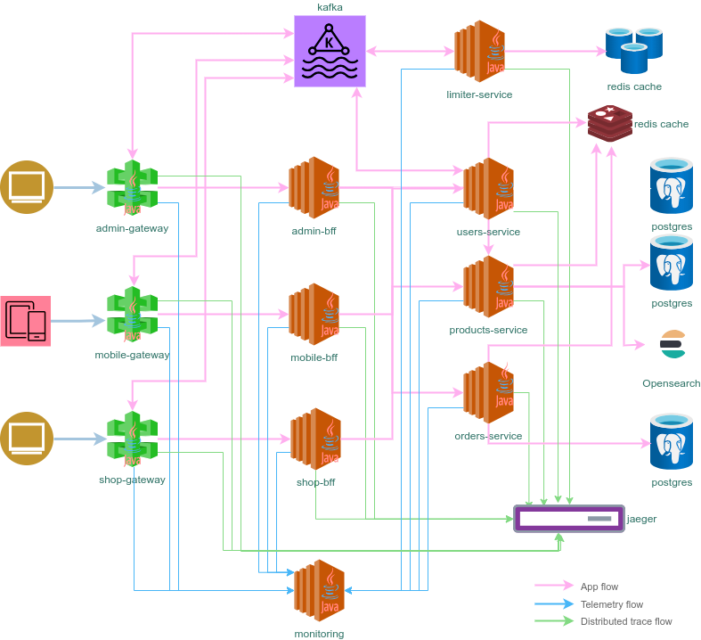

# Gateway

[](https://github.com/sjexpos/ecomm-gateway/releases/latest)
[](https://github.com/sjexpos/ecomm-gateway/actions?workflow=CI)
[](https://codecov.io/gh/sjexpos/ecomm-gateway)
[](https://github.com/sjexpos/ecomm-gateway/issues)
[](https://github.com/sjexpos/ecomm-gateway/commits)

[](https://hub.docker.com/r/sjexposecomm/gateway)
[](https://hub.docker.com/r/sjexposecomm/gateway/tags)



This component is responsible for implement the entrypoint for each backend for frontend service. It adds request rate limit per user and unified authorization/authentication.


## Framework

* [Spring Boot 3.3.2](https://spring.io/projects/spring-boot/)
* [Spring Cloud 2023.0.3](https://spring.io/projects/spring-cloud)

## Requirements

* [Java 21](https://openjdk.org/install/)
* [Maven 3.6+](https://maven.apache.org/download.cgi)
* [AWS Cli](https://aws.amazon.com/es/cli/)
* [Docker](https://www.docker.com/)

## Build

```bash
mvn clean install
```

## Run Tests
```bash
mvn clean tests
```

## Runtime requeriments

* **BFF Api by client type** - the backend for frontend service which is forwaded by this gateway

### Run application
```
./run.sh
```

## Run test from IDE

All integration test need Kafka and Redis running locally. All servers are started by maven before that those tests are run.
When a test has to be run into an IDE the servers are not running.
But it can be fixed if the following command is run in this folder:

```bash
> mvn pre-integration-test
```

This command will run all plugin which were defined on this maven phase.

When the servers must be shutdowned the command `mvn post-integration-test` won't work. So, it is need to use docker stop.

```bash
> docker stop -t 1 <kafka container id> <zookeper container id> <redis container id>
```

The container ids can be gotten using:

```bash
> docker ps
```
